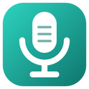

<p align="center"></p>

<h1 align="center">Mirza — voice typing for any app</h1>

<p align="center">
Press a shortcut, speak, and your words are typed wherever your cursor is.<br>
Free, open-source speech-to-text dictation for <b>Linux, Windows and macOS</b>.
</p>

<p align="center">
<a href="https://github.com/erfnemati/mirza/releases/latest"></a>
<a href="https://github.com/erfnemati/mirza/actions/workflows/ci.yml"></a>

</p>

Mirza (from «میرزا بنویس», "Mirza, write this down") is a small tray app that
turns your voice into text in any program: your editor, browser, chat apps,
email, terminal. It uses a cloud speech-to-text service of your choice
(**Soniox**, **OpenAI** or **ElevenLabs**) with your own API key, and it is
very light: about 9 MB of memory while it waits.

## Why use it

- **Typing is slow or painful for you.** Say it instead: long messages, notes,
  emails, code comments.
- **Talk to AI tools faster.** Dictate a long, messy prompt, then let ChatGPT,
  Claude or any LLM clean it up and structure it.
- **You write in more than one language.** Mix Persian (Farsi) and English in
  the same sentence; Mirza types both correctly, half-spaces included.
- **You want dictation that works everywhere.** Not just in one app or browser:
  Wayland and X11 on Linux (KDE Plasma, GNOME), Windows, macOS.

It is an open-source alternative to tools like Wispr Flow, Superwhisper, and
the built-in voice typing of Windows and macOS.

## Features

- **Global shortcuts.** Press to start and stop, or hold to talk. A single
  key like Right Ctrl works on Windows and macOS.
- **Live, real-time transcription**, typed as you speak each phrase.
- **Services:** Soniox, OpenAI (GPT transcribe, Whisper) or ElevenLabs Scribe.
  Switch between them from the tray.
- **Recognition help:** language hints, and custom words for names and jargon.
- **Tray and settings:** a tray icon that shows when it's recording, and a
  settings window with your usage and spend.
- **Pauses** if you switch windows mid-sentence, so text never lands in the
  wrong app.
- **Proxy support** (HTTP and SOCKS5).

## Install

Download the file for your system from the
**[latest release](https://github.com/erfnemati/mirza/releases/latest)**.

### Linux

| Distribution | File | Command |
|---|---|---|
| Debian, Ubuntu, Mint | `mirza_<version>_amd64.deb` (or `arm64`) | `sudo apt install ./mirza_*.deb` |
| Fedora, openSUSE | `mirza-<version>.x86_64.rpm` (or `aarch64`) | `sudo dnf install ./mirza-*.rpm` |
| Others | `mirza-<version>-linux-<arch>.tar.gz` | unpack, then run `./install.sh` |

Log out and back in once (so Mirza may use its virtual keyboard), then start
**Mirza** from your app menu.

Global shortcuts need KDE Plasma 6 or GNOME 48 and later. On other desktops,
bind the command `mirza toggle` to a key in your keyboard settings.

### Windows

Run `Mirza-<version>-windows-x64-setup.exe`. It installs for your user only,
without administrator rights.

The installer isn't signed yet, so Windows SmartScreen may warn you: click
**More info**, then **Run anyway**.

### macOS

Open `Mirza-<version>-macos-universal.dmg` (Apple Silicon and Intel) and drag
Mirza to Applications. The first time you open it:

1. Go to **System Settings → Privacy & Security** and click **Open Anyway**.
2. Allow **Microphone** when asked.
3. Allow **Accessibility**, so Mirza can see its shortcut and type.

## Getting started

1. Click the Mirza icon in the tray to open the settings.
2. Choose a service and paste its API key. Get one here:
   [Soniox](https://console.soniox.com),
   [OpenAI](https://platform.openai.com/api-keys) or
   [ElevenLabs](https://elevenlabs.io/app/settings/api-keys).
3. Under **Shortcuts**, set a key for dictation. Then press it in any app and
   start talking.

## Privacy

- **When it listens:** audio is recorded only while you dictate.
- **Where audio goes:** only to the speech service you picked.
- **Your API keys** stay on your computer, readable only by you.
- **Your text** is kept in memory for the "Recent text" list and never saved
  to disk.

## Build from source

Needs [Rust](https://rustup.rs). On Linux, you also need the WebKitGTK
development files:

```sh
sudo apt install libwebkit2gtk-4.1-dev libgtk-3-dev librsvg2-dev   # Debian/Ubuntu
cargo build --release -p mirza -p mirza-panel
scripts/install-linux.sh    # optional: install for your user
```

Contributions are welcome. See [docs/testing.md](docs/testing.md) for a manual
test checklist.

## License

[MIT](LICENSE)
